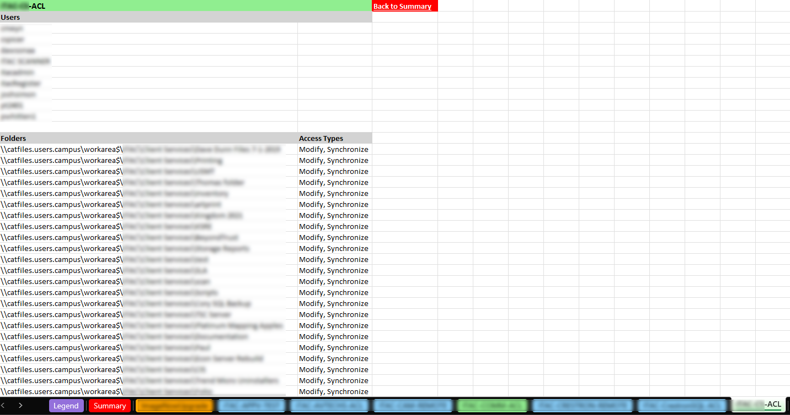
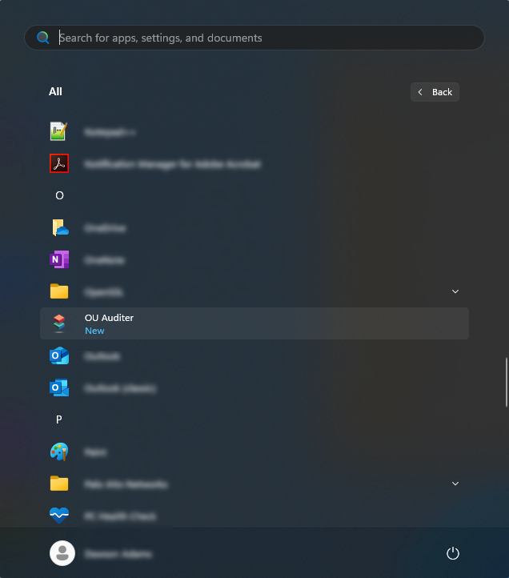

#  OU Auditer  

---

####  Developed by Dawson Adams (dawsonaa@ksu.edu, [GitHub](https://github.com/dawsonaa)) at Kansas State university  

---

## Overview
This PowerShell script exports Active Directory (AD) group memberships for a specified Organizational Unit (OU). Additionally, it retrieves W drive folder access permissions associated with these groups and their members. This audit ensures that groups provide the intended access and verifies group membership accuracy.

## GUI

## Legend Sheet

## Group Sheet

## Features
- Extracts AD group memberships for a selected OU.
- Retrieves associated W drive folder access permissions.
- Exports organized Excel reports, including:
    - Group memberships.
    - Folder access permissions.
    - A legend sheet for easy reference.
- Allows quick access to exported reports via the **"View Exports"** button in the GUI.

## Prerequisites
- PowerShell 5.1 or later.
- Active Directory module for PowerShell.
- Sufficient permissions to query AD and access W drive permissions.

## Usage
1. **Open the application** by clicking the icon on the desktop or from the start menu  
   .
2. **Specify the target OU** and the target network folder location when prompted.
3. **Review the generated report** by pressing the **"View Exports"** button on the GUI to open your exports folder containing the organized Excel files.

---