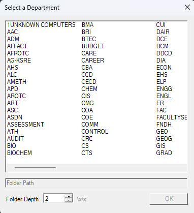
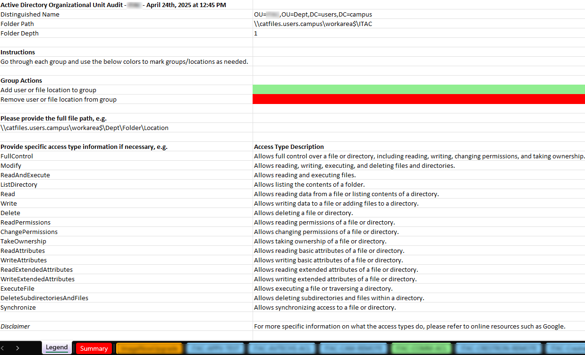

# Active Directory OU Group & Access Audit Script
## Author: Dawson Adams (dawsonaa@ksu.edu)

## Overview
This PowerShell script exports Active Directory (AD) group memberships for a specified Organizational Unit (OU). Additionally, it retrieves W drive folder access permissions associated with these groups and their members. This audit ensures that groups provide the intended access and verifies group membership accuracy.

## GUI


## Legend Sheet


## Features
- Extracts AD group memberships for a selected OU.
- Retrieves associated W drive folder access permissions.
- Provides a comprehensive report to validate access control.
- Ensures AD groups are granting appropriate access.
- Identifies members of each group to verify correct assignments.

## Prerequisites
- PowerShell 5.1 or later.
- Active Directory module for PowerShell.
- Sufficient permissions to query AD and access W drive permissions.

## Usage
1. **Run the script** in a PowerShell session with the required permissions.
2. **Specify the target OU** when prompted.
3. **Review the generated report** to analyze group memberships and access rights.

## Example Execution
```powershell
.\ad-ou-audit.ps1
